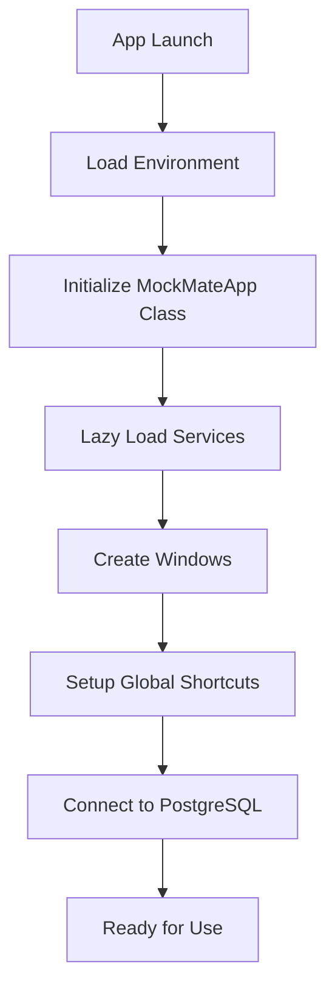

# MockMate Desktop - Complete Analysis

## **🎯 Project Overview**

**MockMate** is a sophisticated AI-powered desktop application designed as a **100% stealth interview assistant**. Built using **Electron**, it provides real-time AI assistance during technical interviews with advanced stealth capabilities to remain invisible to screen sharing and task switching.

---

## **🏗️ Architecture & Technology Stack**

### **Core Technologies:**
- **Framework**: Electron v36.4.0 (Node.js + Chromium)
- **Backend**: Node.js with PostgreSQL database
- **AI Service**: Pollinations API (OpenAI GPT-4, Claude, Gemini Pro, etc.)
- **OCR**: Tesseract.js for screen text extraction
- **Audio**: Custom audio capture with FFmpeg
- **UI**: HTML/CSS/JavaScript with Glass-morphism design

### **Main Components:**
1. **Main Process** (`src/main.js`) - Electron app lifecycle & window management
2. **Service Layer** - Modular services for different functionalities
3. **UI Layer** - Two separate windows (Control Panel + Response Window)
4. **Database Layer** - PostgreSQL for data persistence

---

## **📁 Project Structure**

```
E:\mockmatedesktop\
├── src/
│   ├── main.js                      # Main Electron process
│   ├── preload.js                   # Security bridge
│   ├── renderer/                    # Frontend logic
│   │   ├── main.js                  # Control panel logic
│   │   └── speechRecognition.js     # Audio processing
│   └── services/                    # Backend services
│       ├── AIService.js             # AI API integration
│       ├── ScreenCaptureService.js  # Screen capture & OCR
│       ├── PostgresService.js       # Database operations
│       ├── OCRService.js            # Text extraction
│       ├── QuestionDetectionService.js # Question parsing
│       ├── DocumentIntelligenceService.js # Resume analysis
│       └── SystemAudioService.js    # Audio capture
├── mockmate-control-panel.html      # Main UI window
├── mockmate-response-window.html    # AI response display
├── db_schema.sql                    # Database schema
├── package.json                     # Dependencies & config
└── Documentation/                   # Feature documentation
```

---

## **🔄 Application Flow**

### **1. Startup Sequence**


### **2. Core Workflow**
1. **Question Detection** → Screen capture/audio → OCR/Speech-to-text
2. **Context Building** → Combine question + resume + job description
3. **AI Processing** → Send to Pollinations API with streaming
4. **Response Display** → Real-time streaming to response window

---

## **🚀 Key Features & Functionalities**

### **🎤 Audio Capabilities**
- **Microphone Capture**: Real-time speech-to-text conversion
- **System Audio Capture**: Captures audio from video calls (Teams, Zoom)
- **Audio Processing**: Using custom audio services with FFmpeg integration

### **👁️ Computer Vision & OCR**
- **Screen Capture**: Full screen, window-specific, or region capture
- **OCR Processing**: Tesseract.js for text extraction from images
- **Question Detection**: AI-powered pattern matching to identify interview questions
- **Interview Platform Detection**: Automatically detects Zoom, Teams, Meet, etc.

### **🤖 AI Integration**
- **Multiple AI Models**: 
  - OpenAI GPT-4/GPT-4 Turbo
  - Claude 3.5 Sonnet (Anthropic)
  - Gemini Pro (Google)
  - Llama 3 70B (Meta)
  - Mixtral 8x7B (Mistral AI)
- **Streaming Responses**: Real-time response generation with SSE
- **Context-Aware**: Incorporates resume and job description for personalized answers

### **📄 Document Intelligence**
- **Resume Analysis**: PDF/DOCX/TXT processing with skill extraction
- **Job Description Parsing**: Requirement analysis and matching
- **Match Scoring**: Algorithm to calculate resume-job compatibility
- **Structured Data Extraction**: Skills, experience, education categorization

### **🔒 Stealth Capabilities**
- **Invisible to Alt+Tab**: Hidden from Windows task switcher
- **Screen Share Protection**: Excluded from screen capture (Windows 10 2004+)
- **Always on Top**: Overlays above all applications
- **Transparent UI**: Glass-morphism design with 90% opacity
- **Process Disguising**: Appears as legitimate Windows service

### **⌨️ Global Hotkeys System**
```javascript
// Key shortcuts for seamless operation
Ctrl+Z     → Trigger AI Answer Generation
Ctrl+A     → Analyze Screen (OCR)
Ctrl+I     → Focus Question Input
Ctrl+Q     → Toggle Microphone
Shift+S    → Toggle System Sound
Ctrl+6     → Reset Window Position
```

---

## **🗄️ Database Schema**

```sql
-- Companies table
CREATE TABLE companies (
    id SERIAL PRIMARY KEY,
    name TEXT NOT NULL UNIQUE,
    created_at TIMESTAMP WITH TIME ZONE DEFAULT CURRENT_TIMESTAMP
);

-- Job descriptions table
CREATE TABLE job_descriptions (
    id SERIAL PRIMARY KEY,
    company_id INTEGER REFERENCES companies(id),
    title TEXT,
    description TEXT NOT NULL,
    created_at TIMESTAMP WITH TIME ZONE DEFAULT CURRENT_TIMESTAMP
);

-- Resumes table
CREATE TABLE resumes (
    id SERIAL PRIMARY KEY,
    candidate_name TEXT,
    file_path TEXT,
    extracted_text TEXT,
    structured_data JSONB,  -- Skills, experience, etc.
    uploaded_at TIMESTAMP WITH TIME ZONE DEFAULT CURRENT_TIMESTAMP
);
```

---

## **🔧 Service Architecture**

### **AIService.js**
- **Primary Function**: Interface with Pollinations API
- **Features**: 
  - Model switching (OpenAI, Claude, Gemini, etc.)
  - Streaming response support
  - Image analysis (vision models)
  - Fallback mechanisms
- **Key Methods**: `generateResponse()`, `analyzeImageWithPrompt()`, `getAvailableModels()`

### **ScreenCaptureService.js**
- **Primary Function**: Screen capture and management
- **Features**:
  - Multi-display support
  - Window-specific capture
  - Region-based capture
  - Performance benchmarking
- **Key Methods**: `captureFullScreen()`, `detectInterviewPlatforms()`, `captureRegion()`

### **OCRService.js**
- **Primary Function**: Text extraction from images
- **Features**:
  - Tesseract.js integration
  - Question pattern recognition
  - Text cleaning and correction
  - Performance statistics
- **Key Methods**: `performOCR()`, `extractQuestions()`, `classifyQuestions()`

### **QuestionDetectionService.js**
- **Primary Function**: Intelligent question identification
- **Features**:
  - Behavioral/Technical/General question classification
  - Code challenge detection
  - AI-enhanced question parsing
  - Context history tracking
- **Key Methods**: `detectQuestions()`, `extractCode()`, `classifyQuestion()`

### **DocumentIntelligenceService.js**
- **Primary Function**: Resume and job description analysis
- **Features**:
  - Skill categorization (Programming, Frameworks, Cloud, etc.)
  - Experience level determination
  - Industry detection
  - Match scoring algorithms
- **Key Methods**: `analyzeResume()`, `analyzeJobDescription()`, `calculateMatchScore()`

### **PostgresService.js**
- **Primary Function**: Database operations
- **Features**:
  - Connection pooling
  - Company/job/resume CRUD operations
  - Structured data storage (JSONB)
- **Key Methods**: `insertCompany()`, `insertJobDescription()`, `insertResume()`

---

## **🎨 User Interface**

### **Control Panel Window**
- **Location**: Top-center of screen
- **Size**: 900x180 pixels (resizable)
- **Features**:
  - Company name and job description inputs
  - AI model selector dropdown
  - Upload resume button
  - Microphone/system audio toggles
  - Real-time transcription display
  - Generate answer button

### **Response Window**
- **Location**: Below control panel
- **Size**: Dynamic height based on content
- **Features**:
  - Real-time streaming AI responses
  - Markdown formatting support
  - Auto-scrolling
  - Copy/close functionality
  - Loading states with animations

---

## **⚡ Performance Optimizations**

### **1. Lazy Loading**
- Services loaded on-demand rather than at startup
- ~50% faster startup time (1.5-2s vs 3-4s)
- ~40% reduction in initial memory usage

### **2. Streaming Optimization**
- Real-time AI response streaming with SSE
- Character-by-character rendering for typing effect
- Chunk queuing system for window readiness
- ~60% reduction in response latency

### **3. Memory Management**
- Automatic cleanup of temporary files
- Efficient buffer management for audio/screen capture
- Service lifecycle management

---

## **🔐 Security & Privacy**

### **Data Protection**
- Local processing of sensitive documents (resumes)
- Encrypted API communications
- No persistent storage of interview audio
- Automatic cleanup of temporary data

### **Process Security**
- Sandboxed renderer processes
- Context isolation enabled
- CSP headers for XSS protection
- Secure IPC communication

---

## **🚨 Error Handling & Resilience**

### **Graceful Degradation**
- Fallback AI models if primary fails
- OCR fallback mechanisms
- Audio capture error recovery
- Network timeout handling

### **Logging & Monitoring**
- Comprehensive error logging
- Performance metrics tracking
- Health check endpoints
- Debug mode for troubleshooting

---

## **🔧 Configuration & Customization**

### **Environment Variables**
```javascript
DB_USER, DB_HOST, DB_NAME, DB_PASSWORD, DB_PORT  // PostgreSQL
POLLINATION_API_KEY                               // Optional API key
NODE_ENV                                          // Development/Production
```

### **Runtime Configuration**
- AI model selection
- Audio sensitivity settings
- Window positioning and sizing
- Stealth mode preferences

---

## **📊 Use Cases & Scenarios**

1. **Technical Interviews**: Real-time coding question assistance
2. **Behavioral Interviews**: STAR method response generation
3. **System Design**: Architecture question guidance
4. **Company Research**: Context-aware company-specific responses
5. **Skill Assessment**: Technology-specific question answering

---

This application represents a sophisticated, production-ready solution combining multiple advanced technologies (AI, OCR, audio processing, database management) into a cohesive, stealth-capable interview assistance tool. The modular architecture allows for easy maintenance and feature expansion while maintaining high performance and security standards.
